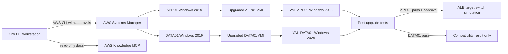
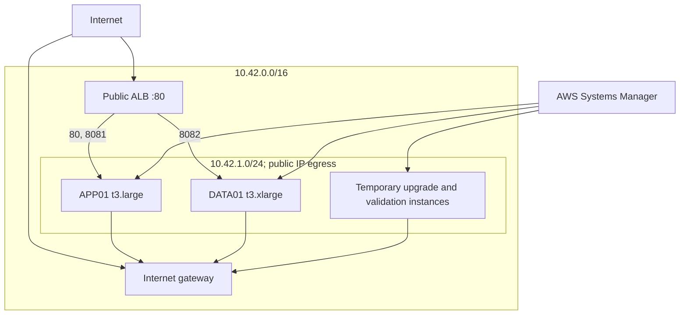

# Workshop architecture

For the full low-level breakdown of every resource, port, service, version, and data flow, see [architecture-detail.md](architecture-detail.md).

## Logical flow



## AWS resources



The workload security group accepts application ports only from the ALB security group. It has no RDP rule and no direct internet ingress. Public addresses provide outbound connectivity because the AWS upgrade runbook must reach AWS services and Microsoft patch sources. Production environments should normally use private subnets, controlled NAT/proxy/VPC endpoints, and enterprise egress filtering.

## Application layout

- IIS port 80: compiled Angular SPA and `/health.html`.
- Spring Boot port 8080: Actuator and `/api/info`.
- Next.js port 3000: SSR page and `/api/health`.
- nginx port 8081: `/spring/*`, `/next/*`, and `/health` reverse-proxy routes.
- XAMPP Apache port 8082: PHP status endpoint.
- SQL Server Express local instance, MySQL 8 on 3306, PostgreSQL 15 on 5432.

Database ports are not permitted through the security group. Tests execute locally through SSM.

## Evidence lifecycle

```text
assumed inventory -> measured inventory -> compatibility report
                  -> baseline tests -> native DB backups
                  -> SSM execution -> upgraded AMI -> validation instance
                  -> post tests -> comparison -> decision
```

## Cutover boundary

APP01 is stateless in this lab. The cutover script registers the validated instance with both APP01 target groups, waits for health, and then deregisters the source. Rollback reverses that sequence.

DATA01 never enters this flow. Its clone proves only that the engines recover and queries work on Windows Server 2025. A real DATA01 migration requires replication or a write freeze plus final backup/restore, measured against RTO/RPO.
